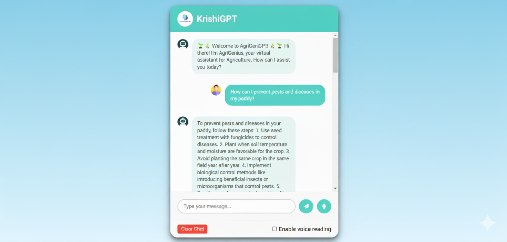

# KrishiGPT: AI-Powered Agriculture Chatbot

## Project Overview
KrishiGPT is a Python-based web application designed to empower farmers by providing easy access to agricultural information. It leverages a Retrieval-Augmented Generation (RAG) model to answer farmers’ queries. The RAG model retrieves the most relevant information from a curated repository of agricultural websites and PDF documents, and uses it to generate informative, accurate, and context-aware responses tailored to each user's specific question.

KrishiGPT is designed to simplify complex agricultural knowledge, making it accessible to farmers, students, and agriculture enthusiasts alike.

## Features

- Fetch content from specified websites and agricultural resources.

- Extract text from PDF files containing research papers, guides, and reports.

- Initialize a vector store for fast and efficient retrieval of relevant information.

- Set up a Retrieval QA chain using a language model to answer agricultural queries.

- Web interface with a user-friendly chat system for interacting with the AI.

- Supports multilingual queries (English and potentially local languages).

- Lightweight and easy to deploy on local machines or servers.

- Scalable architecture for future integration with voice assistants or mobile apps.

## Installation

Run the following Commands.

`STEP 1` - Creating virtual enviroment :
To do so:-
```bash
  pip install virtualenv
```
```
  virtualenv env
  .\env\Scripts\activate.ps1
```
----
`STEP 2` - Cloning the Repository :
```
    git clone https://github.com/jayeshbhandarkar/KrishiGPT.git
    cd KrishiGPT
```
----
`STEP 3` - Installing all the Dependancies :

```
    pip install -r requirements.txt
```
---
`STEP 4` - Run the flask web application
```
    python app.py
```
---
`STEP 5` - Open Web-Browser (Chrome) and navigate to `http://127.0.0.1:5000` to use this web-application.

---
`STEP 6` - Type your questions in the input field and get instant AI-powered answers.

---

## Screenshot
- ### KrishiGPT ChatBot Interface


## Additional Notes

- The language model used is meta-llama/Llama-2-70b-chat-hf.
- The application uses the Together API for LLM services.
- Add your own Together API key in the chat2.py file.
  
```
llm = Together(
	model="meta-llama/Llama-2-70b-chat-hf",
	max_tokens=512,
	temperature=0.1,
	top_k=1,
	together_api_key="YOUR_Together_API_KEY"
)
```

- The requirements.txt should include all necessary packages such as Flask, requests, PyPDF2, langchain, chroma, and any other dependencies required by your project.
- Make sure your PDF and website data sources are organized in the Data/ folder.
- Lightweight enough to run on local machines but scalable for cloud deployment.

## Future Enhancements

- Multilingual support for local Indian languages like Hindi, Marathi, Telugu, etc.

- Voice interface integration using text-to-speech APIs for hands-free use.

- Mobile app integration to allow farmers to access information on smartphones.

- Advanced crop and disease prediction modules using ML models.

- Analytics dashboard to monitor queries and improve the AI system over time.

## Contributing

- Feel free to fork the repository and submit pull requests.

- Please ⭐ the repository if it helped you in any way.

- Report bugs or request features via the GitHub Issues tab.

## 😊 Thank You!

KrishiGPT aims to empower farmers with AI, bridging the gap between technology and agriculture.
Stay tuned for updates and future improvements!
